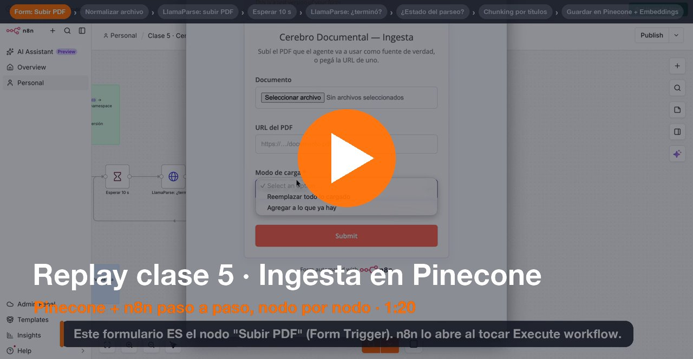

# Clase 5 · Ingesta de PDFs en Pinecone (n8n)

**Coderhouse · AI Automation Avanzado (V2) · Semana 5**

Un PDF (archivo o URL) → **LlamaParse** lo pasa a texto → se corta por títulos → **Cohere** convierte cada pedazo en vectores → se guarda en **Pinecone**. Sirve para cualquier PDF.

## 🎬 Replay de la clase (1:20)

<!-- REPLAY-VIDEO: para ver el reproductor adentro del README, editá este archivo en GitHub, arrastrá el .mp4 en esta línea y dejá el link https://github.com/user-attachments/assets/... que genera. -->

## Cómo usarlo

1. **Pinecone** → *Create index* → **Custom settings** · Dense · **1024** · cosine · Serverless AWS us-east-1 (como en el video).
2. **n8n** → *Import from File* → [`workflow/clase-5-ingesta.json`](workflow/clase-5-ingesta.json).
3. Credenciales: **LlamaCloud** (*Bearer Auth*, en los **dos** nodos de LlamaParse), **Cohere** y **Pinecone**. No hay keys en este repo.
4. En **Guardar en Pinecone** elegí tu índice.
5. **Execute workflow** → se abre el formulario (es el nodo *Subir PDF*) → pegá la URL o subí el PDF → *Modo de carga* → Submit.
6. Verificalo en Pinecone → tu índice → *Browser* → namespace `documentos`.

PDF de ejemplo: [`Reglamento-General-LPF-2025.pdf`](Reglamento-General-LPF-2025.pdf) · URL: `https://raw.githubusercontent.com/jeyzee23/clase-5-rag-n8n/main/Reglamento-General-LPF-2025.pdf`

## Nodos

| # | Nombre | Tipo | Qué hace |
|---|---|---|---|
| 1 | Subir PDF | Form Trigger | Formulario de entrada: archivo o URL del PDF + *Modo de carga* (Reemplazar / Agregar) |
| 2 | Normalizar archivo | Code | Deja el PDF en `data`, venga subido o por URL ([`js/01`](js/01-normalizar-archivo.js)) |
| 3 | LlamaParse: subir PDF | HTTP Request (POST) | Manda el PDF a LlamaCloud y recibe un `id` de trabajo. El campo `file` va como **n8n Binary File** |
| 4 | Esperar 10 s | Wait | Pausa antes de preguntar si terminó |
| 5 | LlamaParse: ¿terminó? | HTTP Request (GET) | Consulta el trabajo y trae el markdown (`expand=markdown_full`) |
| 6 | ¿Estado del parseo? | Switch | `COMPLETED` → sigue · `FAILED` → error · otro → vuelve al 4 |
| 7 | Parseo falló | Stop and Error | Corta y muestra el error de LlamaParse |
| 8 | Chunking por títulos | Code | Limpia el markdown y lo corta por secciones, con sección y página ([`js/02`](js/02-chunking-por-titulos.js)) |
| 9 | Guardar en Pinecone | Pinecone Vector Store (Insert) | Guarda los pedazos en el namespace `documentos`. *Reemplazar* borra lo anterior |
| 10 | Cargar chunk + metadata | Default Data Loader · sub-nodo de 9 | Texto + metadata `source`, `seccion`, `pagina`, `chunk` |
| 11 | No volver a cortar | Recursive Character Text Splitter · sub-nodo de 10 | Tamaño 4000: no vuelve a partir lo que ya cortó el 8 |
| 12 | Embeddings (ingesta) | Embeddings Cohere · sub-nodo de 9 | Convierte cada pedazo en 1024 números (`embed-multilingual-v3.0`) |

## Próxima clase

**Flujo de consultas:** un agente con chat que busca en este índice, responde citando la fuente y dice "No sé" cuando el dato no está. *(pendiente)*
